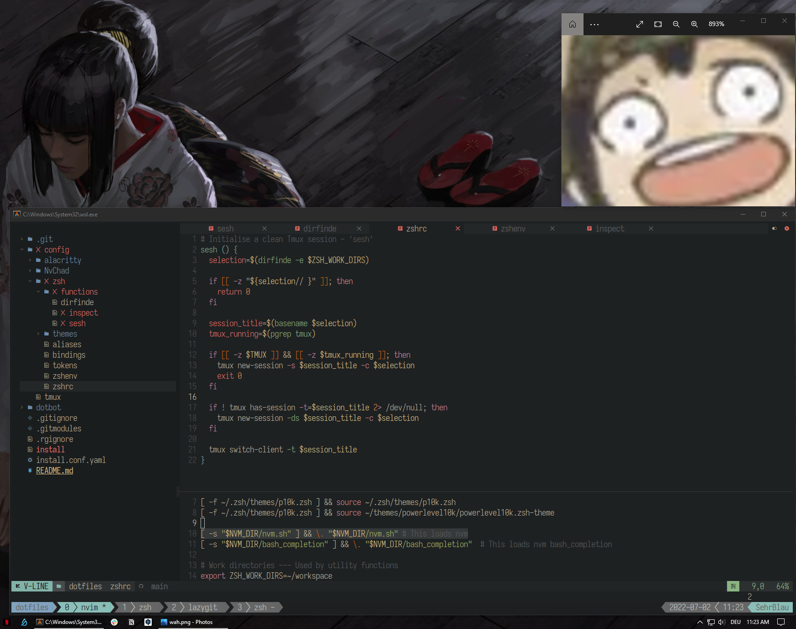

# Yes

I use this for both MacOS and Windows. 

Always a **WIP**

 

Stuff to install:
1. Alacritty
2. [Neovim](https://neovim.io/) latest stable + [NvChad](https://nvchad.github.io/)
3. [Tmux](https://github.com/tmux/tmux)
4. [Iosevka](https://typeof.net/Iosevka/) (I use the [Nerd Font Variant](https://github.com/ryanoasis/nerd-fonts/tree/master/patched-fonts/Iosevka))

I'm in the process of moving off NvChad, but the config for it is still completely functional.

 

## Screenshots
 

